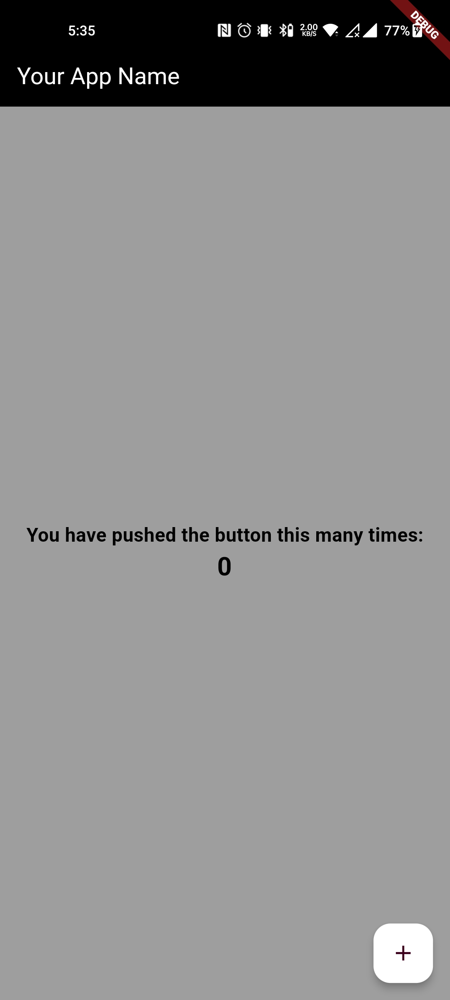

# Project Name

A brief description of your project.

## Screenshots

Include screenshots of your app here to give users a visual representation of what your project looks like. You can add screenshots by adding the image files to the project repository and referencing them here.

<div style="display:flex; justify-content:center;">
  
  
</div>

## Features

- List the key features and functionalities of your project.

## Getting Started

These instructions will get you a copy of the project up and running on your local machine for development and testing purposes.

### Prerequisites

- List any prerequisites or dependencies required to run the project.

### Installing

1. Clone the repository to your local machine using the following command:

   ```
   git clone https://github.com/your-username/project-name.git
   ```

2. Open the project in your preferred IDE.

3. Install the required dependencies by running the following command:

   ```
   flutter pub get
   ```

### Running the Project

1. Ensure that an emulator or a physical device is connected to your machine.

2. Run the following command to launch the app:

   ```
   flutter run
   ```

## Usage

Provide instructions and examples on how to use your project. Include any relevant details about the app's functionality, UI navigation, and usage scenarios.

## Contributing

Provide guidelines for other developers who wish to contribute to your project. Include information on how they can submit bug reports, feature requests, and pull requests.

## License

Specify the license under which your project is released.

## Contact

Provide contact information for users to get in touch with you, such as email or social media profiles.
